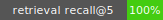

# ragcheck


[](https://github.com/VictoriousAttitude/ragcheck/actions/workflows/ci.yml)
[](https://github.com/VictoriousAttitude/ragcheck/actions/workflows/dogfood.yml)

> pytest for retrieval — measure your RAG search quality, gate it in CI, ship with confidence.

Most RAG failures are retrieval failures: the wrong text gets fetched and the model
confidently answers from it. Teams ship this step with zero measurement. ragcheck turns
retrieval quality into a number you can track, diff, and gate in CI — a test suite for search.

The recall badge above is live: this repository runs ragcheck on its own example corpus
on every push and fails the build if retrieval quality regresses.

## Quickstart

```bash
pip install ragcheck   # not yet on PyPI; for now: pip install git+https://github.com/VictoriousAttitude/ragcheck

ragcheck ingest ./docs -o corpus.jsonl                  # load your documentation
ragcheck generate corpus.jsonl -o evalset.jsonl         # build a leakage-filtered evalset
ragcheck run evalset.jsonl --corpus corpus.jsonl -o results.json
ragcheck report results.json --md report.md --badge badge.svg
```

Lock in a baseline and gate every change:

```bash
cp results.json baseline.json   # commit this
ragcheck run evalset.jsonl --corpus corpus.jsonl -o results.json
ragcheck gate results.json --baseline baseline.json --max-drop 0.05  # exit 1 on regression
```

## Test your own RAG stack

ragcheck evaluates *any* retriever through a five-line adapter. Point `--adapter` at an
instance, a class, or a factory that accepts the corpus documents:

```python
# myadapter.py
from ragcheck.retrievers import RetrievedChunk

class MyRetriever:
    def __init__(self, documents):
        self.index = build_my_existing_index(documents)

    def retrieve(self, query: str, k: int) -> list[RetrievedChunk]:
        hits = self.index.search(query, k)
        return [RetrievedChunk(text=h.text, score=h.score) for h in hits]
```

```bash
ragcheck run evalset.jsonl --corpus corpus.jsonl --adapter myadapter:MyRetriever
```

Returning `doc_id`/`start`/`end` provenance gives exact judging; text-only chunks are
located inside the source documents automatically (whitespace- and case-tolerant).

## How it works

1. **Ingest** — markdown/text documents get stable content-hashed IDs.
2. **Generate** — template-derived questions whose answers are *character spans in the
   source documents*, never chunk IDs. Re-chunking your corpus never invalidates an
   evalset, so chunking strategies compare on equal footing.
3. **Leakage filter** — synthetic questions that quote their answer's wording measure
   nothing; they are dropped, and the rest are tiered easy/medium/hard by how much of
   the query appears verbatim in the answer. Metrics are reported per tier.
4. **Run** — retrieved chunks are judged by span overlap; deterministic metrics:
   hit\_rate@k, recall@k, MRR, nDCG. No LLM judge anywhere in the core.
5. **Gate** — compare against a committed baseline in CI and fail the build when any
   watched metric drops beyond tolerance.

## CI integration

```yaml
- run: pip install ragcheck
- run: ragcheck ingest ./docs -o corpus.jsonl
- run: ragcheck generate corpus.jsonl -o evalset.jsonl
- run: ragcheck run evalset.jsonl --corpus corpus.jsonl -o results.json
- run: ragcheck gate results.json --baseline baseline.json --max-drop 0.05
```

See [`.github/workflows/dogfood.yml`](.github/workflows/dogfood.yml) — this repo gates itself.

## Design principles

1. **Span-anchored ground truth.** Eval sets survive any re-chunking.
2. **Deterministic first.** Same input, same score, forever.
3. **Bring your own stack.** A tiny protocol, no framework lock-in, no heavy core deps.
4. **Everything is a file.** JSONL in, JSON out — diffable, committable, CI-native.

## Benchmarks

The harness is validated against [BEIR](https://github.com/beir-cellar/beir) datasets
(document-level relevance mapped to whole-document gold spans). SciFact, 5183 documents,
300 test queries, reference BM25 retriever:

| retriever | chunk size | hit_rate@10 | recall@10 | ndcg@10 | mrr |
| --- | ---: | ---: | ---: | ---: | ---: |
| bm25 | 300 | 0.753 | 0.729 | 0.590 | 0.556 |
| bm25 | 800 | 0.767 | 0.744 | 0.629 | 0.600 |

Chunk size alone moves nDCG@10 by 4 points on the same corpus and retriever — exactly
the kind of difference these evals exist to catch. Reproduce with
[`benchmarks/beir_runner.py`](benchmarks/beir_runner.py).

## Status

Early development: CLI shape is settling. Next: PDF loading, an optional LLM-assisted
question generator, more BEIR datasets, and a PyPI release.

## License

MIT
